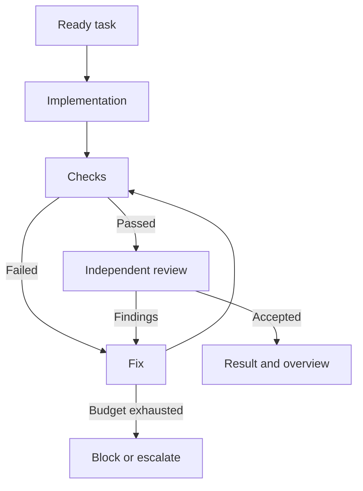

# Agents for specific work: OpenCode and pi

Researched on 26 September 2026. Prepared for Nik.
This text is a translation of the original research note into Simplified Technical English (ASD-STE100) style.

**Recommendation: keep OpenCode for now, split the work into five modes, add Plannotator, and keep task state outside the chat.** Choose pi for a programmable agent of your own, when context, tool, and interface control becomes the main work. A move to pi alone will not create a task queue, research memory, or a clear result view.

This document is a review of current documentation, source repositories, and research. It is not a comparative run of the two harnesses on your machine. The sources are at the end. Do not apply features from current documentation to the installed OpenCode 1.18.32 without a check: record versions and extension compatibility during an experiment.

## 1. What you can call consensus

I did not find a common winner between pi and OpenCode. The same engineering approaches repeat: a small working context, tools on demand, external state, verifiable results, and bounded loops. This is my summary of several sources. It is not a community vote.

Anthropic describes context engineering as the selection of information for the next action. For long work, it examines compaction, notes, and isolated contexts. Experiments with long development use separate stages for planning, implementation, and evaluation. The authors also state that the value of a harness design changes together with the models. [S1–S3]

The practical conclusion for you: **the profile defines the agent capabilities; the workflow defines the order of work; the store holds the facts; the interface helps the human to check them.** Do not put all of this into AGENTS.md.

| Layer | What lives in it | Who controls it |
|---|---|---|
| Profile | Model, permitted tools, short instructions | Configuration |
| Skill | Procedure for PDF, MIDI, diagnostics, one project | Loaded per task |
| Workflow | Transitions, budgets, stops, retries, human review | Program |
| State | Tasks, attempts, results, sources, comments | Files or a DB |
| Presentation | Cards, diffs, explanation, walkthrough | UI and a presenter agent |

The ETH study of repository context files did not find a success improvement in the studied conditions. It found an inference cost increase of more than 20%. This is not proof that AGENTS.md is useless. It is an argument against too many instructions and duplicated documentation. [S4]

## 2. Pi and OpenCode: where the real difference is

| Need | OpenCode | Pi | Conclusion for your case |
|---|---|---|---|
| Several roles | Primary agents and subagents; model, prompt, permissions per agent | Extensions and SDK; you can build roles or take an extension | OpenCode needs fewer changes |
| Context control | Compaction/pruning, plugin hooks; some hooks are experimental | Programmable events and active-tool control | Pi is more interesting for experiments with the agent itself |
| Own UI | Server/SDK and an SSE stream | TypeScript SDK, CLI/RPC, TUI extensions | Both give a base; the result UI is a separate task in any case |
| Local model | Configurable providers, local endpoints | Local and compatible endpoints, models.json | Do not make the choice on this feature alone |
| Action limits | Built-in permissions | The documentation separates project trust from execution isolation | For a personal agent, start with OpenCode, but add OS boundaries separately |
| Visual review | Plannotator integration exists | Plannotator integration exists | This need does not require a harness change |

Confirmed features: OpenCode [S5–S9], pi [S10–S13], Plannotator [S14–S16]. The convenience comparison is my estimate, not a benchmark.

In OpenCode, `tools` is already marked deprecated. For new configurations, the documentation recommends `permission`. There is `steps` to limit the number of iterations. Do not confuse this with a reliable workflow: the limit forces the agent loop to end with text, but it does not prove that the acceptance criteria are met. [S5]

In pi, you can register tools in advance, keep optional tools off, and activate them through a small loader. The documentation warns that a toolset change can cause a checkpoint with some providers and invalidate the cached prefix. This is a controlled tradeoff, not a free saving. [S10]

**When to move to pi:** if a prototype shows that you must implement the key operations through inconvenient or unstable OpenCode hooks, and the direct pi SDK makes them much simpler. "Pi has a smaller initial prompt" is not a sufficient reason for a migration.

## 3. Five modes on one base

The text below is a proposed architecture. It is not a ready standard configuration of these products.

| Mode | Context at the start | Capabilities on demand | Completion |
|---|---|---|---|
| `system` | OS, cwd, request, exact paths | shell/read/edit; PDF/MIDI/diagnostics as necessary | An artifact or a diagnosis, plus a check |
| `code-auto` | One task, criteria, a map of the related code | Code, tests, git; bounded related repositories | All available tasks processed; blockers shown |
| `code-guided` | The same task and criteria | Implementation tools first, then read and comments | After one task: a walkthrough, no automatic continuation |
| `research` | Questions, scope, sources from the cache | search/fetch/extract, a local index | Answers with evidence, or clearly marked gaps |
| `personal` | One operation and the necessary account | Mail/calendar/inbox/site adapter as necessary | A confirmed operation result, or a pending decision |

The profiles do not have to be five always-running agents. They are five ways to start a session with the correct context and boundaries.

### Work with Arch Linux

Keep the common system prompt short. MIDI details are not necessary to read an archive. Rails rules are not necessary to diagnose the CPU. A skill must give a procedure and small executable helpers for repeated operations.

Examples of result contracts:

| Task | What the agent must leave |
|---|---|
| Extract an archive | The path, the content list, and a warning about suspicious paths if they exist |
| Read a PDF | Extracted text with page numbers; OCR/render if necessary |
| Edit a MIDI file | A new version; tempo/events/tracks changes; a second read of the file |
| Find the CPU load | The observation interval, the processes, the measurements; a separate cause hypothesis |

Code is the better tool to collect measurements and to process binary formats. Return a compact summary and references to the full data to the model. The same read command for a changing state, for example a process list, is not a useless duplicate: the cache needs a freshness policy.

### Autonomous coding

A plan of 20 tasks becomes records with stable IDs. The executor gets one ready task and its dependencies, not the full accumulated conversation.



The loop limit applies to the full run, including the review. Do not permit an infinite loop of "one more reviewer found a style issue → one more fix".

Dependent tasks run in sequence. Parallel writes are permitted only with a clear area split and isolated worktrees. A worktree separates Git working copies, but it is not an OS sandbox. For several repositories, keep an explicit list of permitted workspace roots and a base/head SHA pair for each. Test a cross-repository change on the exact revision combination.

### Interactive coding

After implementation, move the run to `awaiting_walkthrough`, and set the presentation session rights to read-only. New feedback creates a separate bounded fix attempt.

The order of the story: **which behavior changed → through which system parts it goes → where it is visible in the code → how it was checked → what is still in question.** Show one step, accept a comment, go to the next step. Do not retell the chronology of tool calls.

"Task complete" means that the task agrees with the predefined criteria and that a check exists. It is not only a model message. If a criterion has no automatic check, the result stays at `needs_review`.

## 4. Results and comments: what already exists

**Plannotator is the closest match to your request that this review found.** The project documents local diff review, line/token/file annotations, plans and documents, and feedback return to the agent. Integrations exist for both harnesses in this review. [S14–S16]

This closes a large part of the feedback loop. But I did not confirm a ready semantic for "one feedback item attached to an arbitrary set of files, folders, and ranges from several tasks". A directory annotation alone does not prove such a model. Test it separately on a real example.

The result panel for your 20 tasks must come from the state. Do not generate it again from the chat history. This is the proposed minimum contract:

```typescript
type TaskResult = {
  taskId: string;
  status: 'passed' | 'needs_review' | 'blocked' | 'failed';
  summary: string;
  why: string;
  changes: Array<{ repo: string; base: string; head: string }>;
  checks: Array<{
    criterionId: string;
    status: 'pass' | 'fail' | 'not_run';
    evidenceRef: string;
  }>;
  unresolved: string[];
  walkthrough: Array<{ title: string; artifactRefs: string[] }>;
};

type Feedback = {
  id: string;
  taskId: string;
  targets: Array<{
    artifactId: string;
    revision: string;
    path?: string;
    lines?: [number, number];
    quote?: string;
  }>;
  text: string;
  status: 'open' | 'resolved' | 'wont_fix' | 'needs_clarification';
  resolutionRef?: string;
};
```

This is a data draft, not the SDK of a product. A revision binding is mandatory: after a change, line 42 can mean different code. Keep the quote and the range context, and mark a stale binding if you cannot move it reliably.

The short overview: "12/20 checked, 3 need a decision, 2 blocked, 3 in the queue", plus one result line per task. The expanded view shows why/how/verify, the diff, the open questions, and the comments. These numbers are illustrative.

## 5. A strong planner → a local executor → a strong review

This pipeline is reasonable, but it does not guarantee a lower total cost. A cheap executor can consume the saving with repeated attempts. Measure the cost of an accepted task and your review time.

| Stage | What it gets | What it returns |
|---|---|---|
| Planner | The goal, the constraints, the related code | Tasks, dependencies, acceptance criteria, important risks |
| Local executor | One task, the necessary files, the check commands | A diff, check results, questions |
| Deterministic checks | An exact revision | Exit codes, reports, evidence |
| Strong reviewer | Criteria, the diff, the related code context, evidence | Exact findings with severity and anchors |
| Fix | Only actionable findings | A new diff and a repeat of the affected checks |
| Presentation | Verified TaskResult records | A short overview and a step-by-step explanation |

The reviewer must have access to the code and the tests, not only to a persuasive executor summary. A separate context decreases the dependence on the executor explanations, but it does not make the reviewer infallible.

The planner sets the result and the constraints. It also keeps the executor able to find a contradiction between the plan and the real code. The Anthropic study notes the risk of error cascading from an initial plan with too much detail. [S3]

For a bounded context, start with an experimental budget per task, for example 20–40k input tokens. Do not fill the available 100–200k automatically. This is a starting hypothesis for measurements, not a proven optimum. If the context is not sufficient, extend the package or split the task; if the same error repeats, escalate.

Check these points on your serving configuration: tool call correctness, patch/edit format, structured output, cancellation, and context truncation. The advertised window size is not equal to reliability at that window size.

## 6. Token efficiency: four different savings

| Mechanism | What it saves | What it does not solve |
|---|---|---|
| Fewer active schemas/instructions | Input context | Execution quality by itself |
| Short tool results with artifact refs | History, prefill, unnecessary reads | Full data must still be stored |
| Prefix/KV cache | Recomputation of the common prefix | It does not decrease the logical context length |
| Page and extraction cache | Network, repeated extraction/OCR/summary | It does not stop the agent from reading everything again |

vLLM directly describes APC as a prefill speedup, not a decoding speedup. Stable instructions and schema order help prefix reuse. [S17]

OpenCode DCP can do deduplication and compression, but the README warns about prompt-cache invalidation when previous messages change. Check the total cost, latency, and cache hit rate, not only a smaller token number. [S18]

Code execution helps to keep intermediate data outside the model context: a script processes a large JSON file and returns a small result. Anthropic describes this approach for MCP. For your case: your `rtmateStatus`/GitLab tools can return a summary plus an artifact reference instead of a full dump. [S19]

About your archive: the export confirms 11,410 input tokens. The tools contribution is an estimate with a different tokenizer and from a separate set of dumps. Use this as an optimization direction. For an exact comparison, keep the redacted final provider request, the harness version, the toolset, and the usage of the same run.

Skills are progressive disclosure of procedures. But a move of a large tool description into a skill only changes the moment of its load. If that skill is mandatory on every run, the saving can disappear.

## 7. Local deep research without loops

**SearXNG is a search layer, not research memory.** The documentation describes metasearch and internal caches. It is not a ready store of questions, claims, and reasons to revisit a source. [S20]

The proposed stack: a local controller in Node/TypeScript, SQLite + FTS, files with snapshots; SearXNG for search, Exa as an optional paid source; a usual fetch/extractor, Crawl4AI for pages that need a browser. Crawl4AI documents cache modes. Exa Contents returns content and controls freshness through `maxAgeHours`. [S21–S22]

"Local" here means local execution and storage. Search queries still go to upstream search engines or Exa. This is not offline research.

| Entity | Minimum data |
|---|---|
| Question | The wording, the parent, the answer criterion, the status |
| Search | Query, engine, filters, time, results, the related question |
| Source | The source and canonical URL, redirects, type, author, dates |
| Snapshot | Hash, fetched_at, ETag/Last-Modified if available, raw/text paths, extractor version |
| Evidence | Snapshot ID, the exact quote/range/page, context |
| Claim | The claim, supporting/contradicting evidence, limits |
| Attempt | The action, the result, the cost, new evidence, the reason for a repeat |

A DAG is useful for question dependencies. For sources and claims, relation tables are sufficient; an evidence graph can contain cycles. A graph DB is not a condition for the solution.

Before a request, the controller checks the search cache; before a download, it checks the URL, the freshness, and the snapshot; before a model call, it checks which fragments were already shown. A repeated read is permitted with a reason: a new version, another question, an unclear quote, or a contradiction check. Do not set a permanent `visited=true` flag.

This is the initial stop policy, and you must tune it with measurements: a limit of sources/calls/time per question; after two passes without new related evidence, change the strategy or finish with a marked gap. Store a download error with `retry_after`, or the agent will hit an unavailable page without end.

Cache summaries by `(snapshot_hash, question, prompt_version, model)`. A question change can require a different extraction. Keep the source text near the summary: a summary can lose a caveat, a date, or a negation. Do not count matching reprints of one news item as independent confirmations.

For the first working version, FTS and metadata are sufficient as a simple base. Add embeddings after a measurement of retrieval gaps. A local model can extract passages and draft claims; a strong model can check disputed conclusions. Every conclusion must lead to a snapshot, not to the retelling of another agent.

Multi-agent research at Anthropic improved their internal results, but used more tokens. It is not evidence that a swarm is economical. For you, start with one researcher and use separate contexts only for independent large questions. [S23]

Open Deep Research is a useful code example of research-iteration limits and different models per stage. However, the main LangChain repository was archived on 21 August 2026. I would not select it automatically as a supported base for a new project. [S24]

## 8. A personal agent: a structure draft

Do not use one process with the bank, mail, shell, and all service tokens open at the same time. For each operation type, use an adapter with narrow actions, start it with the necessary context, and keep a result journal.

| Area | Read/prepare | Change |
|---|---|---|
| Mail | Get new messages, a summary, create a draft | Send as a separate action |
| Calendar | Read events, find a time slot | Create/change an event with parameter checks |
| Inbox/food | Recognize an entry and propose a structure | An idempotent write with a correction option |
| Social media | Read the available notifications | Publish/reply separately from reading |
| Payment | Prepare the details, the amount, the purpose | Confirm the exact payload, execute, and reconcile |

Payment workflow: `prepared → awaiting_confirmation → submitted → reconciled`. Do not execute again after a timeout before you check the actual result. Bind the consent to exact parameters; a parameter change requires new consent. This is an automation architecture, not advice on tax calculation.

For all external changes, use operation IDs, idempotency where the service supports it, and reconciliation where it does not. The durable workflow documentation examines state persistence and resumption separately; interrupts need care with the repeated execution of side effects. LangGraph is a source of patterns here, not a proposal to replace the chosen harness. [S25–S26]

Pi directly warns: cwd and project trust do not limit OS access. Also, do not treat OpenCode permissions as a sandbox replacement for an arbitrary shell. System diagnostics and personal accounts must have different access boundaries. [S13]

## 9. What to take ready-made and what not to build too early

| Component | Practical role | Limit |
|---|---|---|
| Plannotator | The fastest candidate for visual feedback | Check multi-target and task-level bindings |
| pi-subagents | A candidate for pi: roles, models, workflows, observability | The extension needs a compatibility and behavior check |
| GSD Pi | An example of a more complete autonomous system on pi | More opinionated; not a small profile |
| OpenCode DCP | An experiment with context reduction | Measure the effect on cache and quality |

pi-subagents documents scripted workflows, per-role model overrides, artifacts, and observability. GSD Pi describes milestones/slices/tasks, worktrees, and local result records. These are candidates for a study or a trial, not installations that this review checked. [S27–S28]

Do not install everything at once. First, check the most painful cycle: one task → implementation → evidence → a clear review → exact feedback → a fix. This checks the interaction model before you develop your own panel.

## 10. The experiment that will give an answer for you

Take a small repeatable task set: archive extraction, PDF/OCR, MIDI, CPU; a small bugfix, an API change, a refactor with tests, a related task in two repositories; a research task with a repeated URL and contradicting sources. Reproduce personal operations on fixtures/dry-run first.

Compare the current OpenCode, OpenCode with scoped profiles, and pi with an equivalent capability set. For the harness comparison, keep the model and the task the same; compare the cloud/local pipeline in a separate experiment. Fix the Git baseline, the available tools, the versions, and the criteria. Repeat some tasks: one successful run proves little.

| Metric | Why |
|---|---|
| Share of accepted tasks | Do not optimize a broken agent |
| Cost/time of an accepted task | Include retries, review, cache, and local latency |
| Human review time | The main cognitive-overhead metric |
| Repeated reads without a new reason | Find empty cost |
| Unconfirmed completion claims | Check the link between the report and the evidence |
| Saved/lost feedback items | Check that the process is closed |

**First action: test Plannotator on one real task in your OpenCode and create an explicit TaskResult.** If this cycle fits, extend to a queue. Test pi separately on the same task; migrate on a measured gain and implementation simplicity, not on the length of the initial prompt.

## Sources

Viewed on 26 September 2026. Links to main/dev and online docs are not stable; this report does not fix their Git SHA. Marketing and author descriptions of features do not replace a local compatibility check.

| ID | Source | Used for |
|---|---|---|
| S1 | [Anthropic: Effective context engineering](https://www.anthropic.com/engineering/effective-context-engineering-for-ai-agents) | Context, compaction, notes |
| S2 | [Anthropic: Effective harnesses for long-running agents](https://www.anthropic.com/engineering/effective-harnesses-for-long-running-agents) | Long work and handoff |
| S3 | [Anthropic: Harness design for long-running application development](https://www.anthropic.com/engineering/harness-design-long-running-apps) | Planner/generator/evaluator, planning limits |
| S4 | [ETH: Evaluating AGENTS.md](https://www.sri.inf.ethz.ch/publications/gloaguen2026agentsmd) | Empirical limits of context files |
| S5 | [OpenCode: Agents](https://opencode.ai/docs/agents/) | Roles, models, steps, permissions |
| S6 | [OpenCode: SDK](https://opencode.ai/docs/sdk/) | Program control and SSE |
| S7 | [OpenCode: Plugins](https://opencode.ai/docs/plugins/) | Hooks and compaction |
| S8 | [OpenCode: Config](https://opencode.ai/docs/config/) | Config inheritance, compaction |
| S9 | [OpenCode: Providers](https://opencode.ai/docs/providers) | Local endpoints |
| S10 | [Pi: Extensions](https://raw.githubusercontent.com/earendil-works/pi/main/packages/coding-agent/docs/extensions.md) | Dynamic tools, events, UI, state |
| S11 | [Pi: SDK](https://github.com/earendil-works/pi/blob/main/packages/coding-agent/docs/sdk.md) | Embedding |
| S12 | [Pi: Models](https://raw.githubusercontent.com/earendil-works/pi/main/packages/coding-agent/docs/models.md) | Local endpoints and models.json |
| S13 | [Pi: Security](https://raw.githubusercontent.com/earendil-works/pi/main/packages/coding-agent/docs/security.md) | Trust and execution boundaries |
| S14 | [Plannotator: Code review](https://plannotator.ai/code-review/) | Annotations and the feedback loop |
| S15 | [Plannotator: Pi extension](https://github.com/backnotprop/plannotator/blob/main/apps/pi-extension/README.md) | pi integration |
| S16 | [Plannotator: OpenCode plugin](https://github.com/backnotprop/plannotator/blob/main/apps/opencode-plugin/README.md) | OpenCode integration |
| S17 | [vLLM: Automatic Prefix Caching](https://docs.vllm.ai/en/v0.30.0/features/automatic_prefix_caching/) | Prefill against decoding |
| S18 | [OpenCode Dynamic Context Pruning](https://github.com/Tarquinen/opencode-dynamic-context-pruning) | Deduplication, the cache/pruning tradeoff |
| S19 | [Anthropic: Code execution with MCP](https://www.anthropic.com/engineering/code-execution-with-mcp) | Intermediate data outside the context |
| S20 | [SearXNG](https://docs.searxng.org/) and [Caches](https://docs.searxng.org/src/searx.cache.html) | Metasearch/caching boundaries |
| S21 | [Crawl4AI: Cache modes](https://docs.crawl4ai.com/core/cache-modes/) | Extracted-page cache |
| S22 | [Exa: Contents](https://exa.ai/docs/reference/get-contents) | Content, cached/live retrieval, freshness |
| S23 | [Anthropic: Multi-agent research system](https://www.anthropic.com/engineering/multi-agent-research-system) | Delegation, costs, evidence |
| S24 | [LangChain: Open Deep Research](https://github.com/langchain-ai/open_deep_research) and [configuration.py](https://github.com/langchain-ai/open_deep_research/blob/main/src/open_deep_research/configuration.py) | Architecture example; archived status |
| S25 | [LangGraph: Persistence](https://docs.langchain.com/oss/python/langgraph/persistence) | Durable state |
| S26 | [LangGraph: Interrupts](https://docs.langchain.com/oss/python/langgraph/interrupts) | Human decisions and repeated execution |
| S27 | [pi-subagents](https://github.com/nicobailon/pi-subagents) | Roles, workflow, observability |
| S28 | [GSD Pi](https://github.com/open-gsd/gsd-pi) | An autonomous process example on pi |

Not confirmed in this research: the comparative quality of pi/OpenCode on a local model; the compatibility of all current extensions with 1.18.32; full multi-target feedback in Plannotator; the real saving of the proposed hybrid pipeline. These questions need an experimental run, not one more list of best practices.
